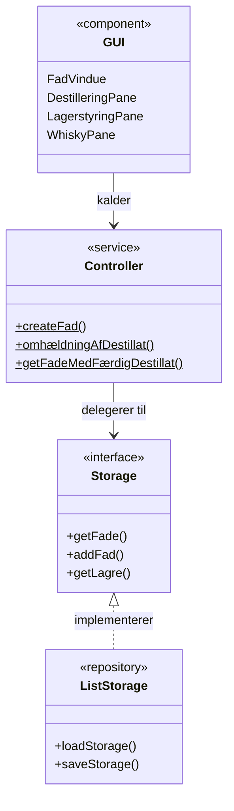
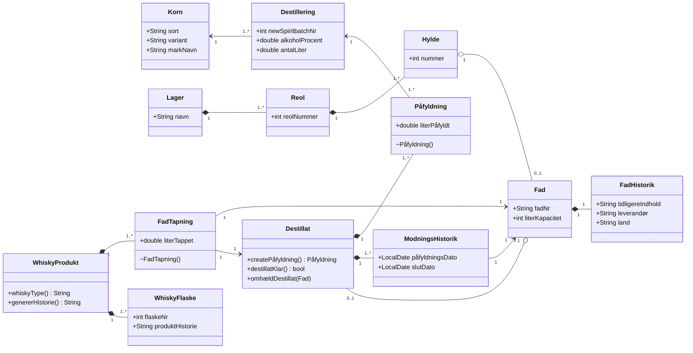
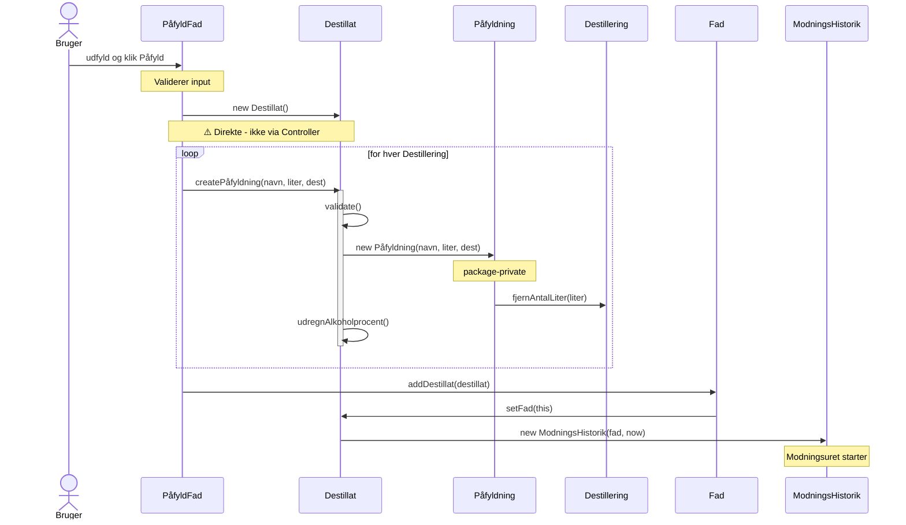
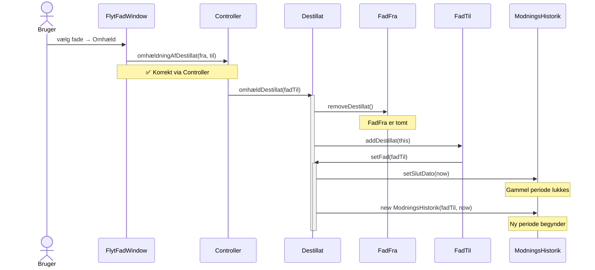

# Diagrammer til slides

Paste hvert diagram ind på **https://mermaid.live**, eksporter som SVG,
og gem i en `diagrams/`-mappe ved siden af SLIDES.md.

Forventet filstruktur:
```
diagrams/
  arch.svg
  domain.svg
  seq-paafyldning.svg
  seq-omhaeldning.svg
```

---

## 1. Arkitektur — `diagrams/arch.svg`



---

## 2. Domænemodel — `diagrams/domain.svg`



---

## 3. Sekvensdiagram: Påfyldning — `diagrams/seq-paafyldning.svg`



---

## 4. Sekvensdiagram: Omhældning — `diagrams/seq-omhaeldning.svg`


