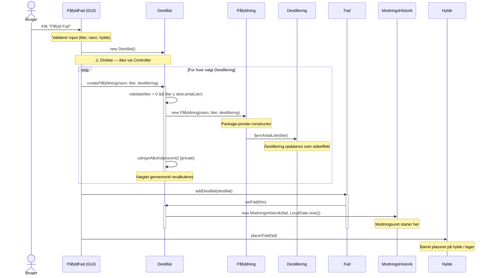
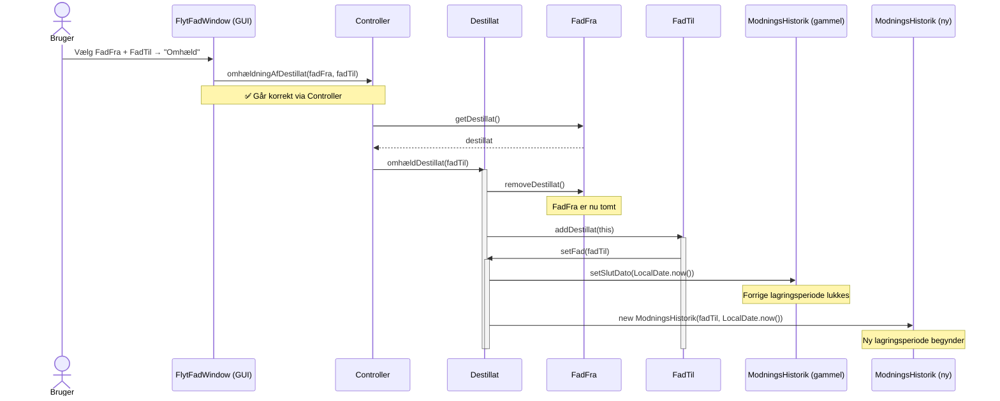

# Case-forberedelse: 2. samtale — Sall Whisky Destilleri

> **Primært kode-eksempel:** `src/application/models/Destillat.java`
> **Rød tråd:** Rig domænemodel → anæmisk/hybrid i Spring Boot — og *hvorfor* det valget er svært

---

## OVERBLIK — Præsentationsstruktur

Casens fire sektioner mappes til slides og supplerende svar:

| Case-sektion | Slides | Supplerende svar |
|---|---|---|
| 1. Kontekst og problemstilling | Slide 1 | — |
| 2. Tekniske valg og overvejelser | Slide 2, 3, 4 | Validering/fejl, Logging/sikkerhed |
| 3. Kvalitet og vedligeholdelse | Slide 5 | Test, Nem/svær at videreudvikle |
| 4. Refleksion | Slide 6 | Overdragelse |

---

---

# 1. KONTEKST OG PROBLEMSTILLING

---

## Slide 1 — Kontekst og problemstilling

**Titel:** Sall Whisky Destilleri — Digital sporbarhed fra korn til flaske

**Indhold:**
- Eksamensprojekt, 3. semester Datamatiker — gruppe på [X] personer
- Mit primære ansvar: [fx domænemodellen / Controller-laget / ...]
- **Problemet:** Destilleriet manglede digital sporbarhed — hvem lavede hvad, hvornår, og hvilke fade har destillatet ligget i?
- **Stack:** Java 19 · JavaFX · JUnit 5 · Object serialization (ingen database, ingen framework)

**Talepunkter:**

*Hvilket problem løser koden?*
> "Applikationen dækker hele produktionskæden: fra hvilken kornsort der er brugt, over destillering og påfyldning i fade, til lagerstyring og til sidst flaskning med automatisk genereret produkthistorie. Ingen Spring, ingen database — vi valgte at serialisere Java-objekterne direkte til disk."

*Hvem arbejdede du sammen med?*
> "Vi var [X] i gruppen. Jeg havde primært ansvar for [beskriv konkret — domænemodellen? Controller-laget?]. Vi fordelte arbejdet sådan at [...]"

---

---

# 2. TEKNISKE VALG OG OVERVEJELSER

---

## Slide 2 — Arkitektur (Hvorfor er koden struktureret som den er?)

**Titel:** 3-lags arkitektur — manuelt implementeret

**Diagram (tegn det op):**
```
┌──────────────────────────────────┐
│  GUI  (JavaFX Panes / Dialogs)   │
└────────────────┬─────────────────┘
                 │ kalder Controller.*
┌────────────────▼─────────────────┐
│  Controller  (static abstract)   │  ← Service Layer
└────────────────┬─────────────────┘
                 │ delegerer til
┌────────────────▼─────────────────┐
│  Storage  (interface)            │
│  └── ListStorage (ArrayList+srl) │  ← Repository Layer
└──────────────────────────────────┘
```

**Indhold:**
- `Controller` er en `abstract class` med **kun static metoder** — GUI kalder altid `Controller.*`
- `Storage` er et **interface** injiceret via `Controller.setStorage(storage)` ved opstart
- `ListStorage` bruger Java-serialisering til én `.srl`-fil

**Talepunkter:**
> "Det er et manuelt implementeret 3-lags mønster — ingen framework. Controller svarer til det der i Spring ville hedde et Service Layer. Det vigtige er Storage-interfacet: ved at injicere implementationen kan vi udskifte den — f.eks. med en mock i tests."

> "En ting jeg ville gøre anderledes: Controller er `abstract` med `static` metoder. Det giver ingen mening — `abstract` er der for at nedarves, og det gør ingen. Det burde enten være en `final class` med privat konstruktør, eller helst en instans-baseret service, så den kan unit-testes med dependency injection."

---

## Slide 3 — Domænemodel (Hvordan modellerede du data og entiteter?)

**Titel:** Domænemodel — whiskyens rejse som objekter

**Diagram:**
```
Korn ──────────────────────────────────────────────────┐
                                                        │
Destillering ←─── maltbatch, korn, medarbejder, ABV   │
     │                                                  │
     ▼ (via)                                            │
  Påfyldning ──────────────────────────────────────────┘
     │
     ▼ (opbygger)
  Destillat ──── alkoholprocent (beregnet), antalLiter
     │     └──── ModningsHistorik (én per fad)
     │
     ▼ (placeres i)
   Fad ──── FadHistorik (tidligere indhold)
     │
     ▼ (via)
  Hylde → Reol → Lager
     │
     ▼ (tappes til)
  FadTapning
     │
     ▼ (indgår i)
  WhiskyProdukt ──── whiskyType(), genererHistorie()
     │
     ▼
  WhiskyFlaske (én per liter)
```

**Talepunkter:**

*Original — ingen DTOs (det ER svaret):*
> "Vi brugte ingen DTOs — GUI'en arbejdede direkte med domæneobjekterne. `PåfyldFad` hentede `List<Destillering>` fra Controller og viste dem direkte. Det er enkelt, men det betyder at GUI-koden er tæt koblet til domænet: ændrer man et felt på `Destillering`, skal man også rette i GUI'en."

> "Serialization til `.srl` fungerede som vores 'ORM' — ingen mappers, ingen konvertering. Det er en af grundene til at vi ikke behøvede DTOs: alt var Java-objekter hele vejen."

*(Supplement — Spring Boot som kontrast, hvis det er relevant i samtalen):*
> "Da jeg lavede Spring Boot-versionen tvang HTTP-laget mig til at tænke i DTOs — hvad sender klienten, og hvad returnerer API'et? Det er en sund adskillelse der beskytter domænemodellen mod at blive dikteret af API-kontrakten."

---

## Slide 4 — Rig domænemodel (Primær kode-slide)

**Titel:** Rig domænemodel — forretningslogikken bor i entiteterne

**Vis `Destillat.java` i IDE'et og gennemgå fire punkter:**

### Punkt 1 — Factory method med validering (`linje 36-46`)
```java
public Påfyldning createPåfyldning(String medarbejderNavn,
                                    double literPåfyldt,
                                    Destillering dest) {
    if (literPåfyldt <= 0 || literPåfyldt > dest.getAntalLiter()) {
        throw new IllegalArgumentException("Invalid volume for påfyldning.");
    }
    Påfyldning pf = new Påfyldning(medarbejderNavn, literPåfyldt, dest);
    påfyldninger.add(pf);
    antalLiter += pf.getLiterPåfyldt();
    udregnAlkoholprocent();
    return pf;
}
```
> "`Påfyldning` har en package-private konstruktør — den kan kun oprettes her, inde fra `Destillat`. Det er compileren der håndhæver invarianten, ikke dokumentation."

### Punkt 2 — Privat beregning, altid konsistent (`linje 157-163`)
```java
private void udregnAlkoholprocent() {
    double literEthanol = 0;
    for (Påfyldning påfyldning : påfyldninger) {
        literEthanol += (påfyldning.getDestillering().getAlkoholProcent() / 100)
                        * påfyldning.getLiterPåfyldt();
    }
    alkoholprocent = (literEthanol / antalLiter) * 100;
}
```
> "Vægtet gennemsnit — liter ethanol divideret med total liter. Den er `private` og kaldes automatisk fra `createPåfyldning()`. Tilstanden kan aldrig blive inkonsistent."

### Punkt 3 — Domæneregel tæt på data (`linje 170-176`)
```java
public boolean destillatKlar() {
    Period p = Period.between(
        modningsHistorik.get(0).getPåfyldningsDato(),
        LocalDate.now()
    );
    return p.getYears() >= 3;
}
```
> "Tre-årsreglen bor i selve entiteten — ikke i en service eller GUI. Det er kernen i den rige domænemodel."

### Punkt 4 — Automatisk historiksporing (`linje 143-155`)
```java
public void setFad(Fad fad) {
    this.fad = fad;
    createModningsHistorik();  // <-- altid
}

private ModningsHistorik createModningsHistorik() {
    if (this.modningsHistorik.size() > 0) {
        this.modningsHistorik.get(this.modningsHistorik.size() - 1)
            .setSlutDato(LocalDate.now());
    }
    ModningsHistorik mh = new ModningsHistorik(fad, LocalDate.now());
    this.modningsHistorik.add(mh);
    return mh;
}
```
> "Hver gang et destillat flyttes til et nyt fad — første gang eller ved omhældning — lukkes forrige periode automatisk og en ny oprettes. Det er umuligt at glemme."

---

## 2A — Validering og fejlhåndtering

### Validering

| | Original (JavaFX) | Spring Boot |
|---|---|---|
| **Model-niveau** | `IllegalArgumentException` i `Destillat.createPåfyldning()` — tjekker `liter > 0` og `liter ≤ dest.antalLiter` | Service kaster `IllegalStateException` i `sletFad()` (kun tomme fade) og `tapFad()` (kun klar destillat) |
| **GUI/API-niveau** | `PåfyldFad` validerer manuelt — tomme felter, ugyldig volume, overskredet kapacitet — viser `Alert`-dialogs | Spring MVC konverterer unchecked exceptions til HTTP 500 automatisk — ingen `@Valid` eller Bean Validation |
| **Konsistens** | Inkonsistent: noget i GUI, noget i modeller, intet i Controller | Inkonsistent: ingen systematisk strategi, ingen `@ControllerAdvice` |

**Hvad burde have været gjort:**
- **Original:** Validering samlet i Controller — ikke spredt over GUI og modeller
- **Spring Boot:** `@Valid` + Jakarta Bean Validation på request-DTOs (`@NotNull`, `@Positive`) og en global `@ControllerAdvice` der returnerer strukturerede fejl-responses

**Talepunkter:**
> "Vi validerede i `createPåfyldning()` med en `IllegalArgumentException` — det er et skridt i den rigtige retning, men der er ikke en systematisk strategi. GUI'en validerer separat, Controller validerer ikke. I Spring Boot-versionen mangler vi både Bean Validation på DTOs og en global exception handler. Det ville jeg prioritere tidligt i et rigtigt projekt."

---

### Fejlhåndtering

| | Original (JavaFX) | Spring Boot |
|---|---|---|
| **Persistence-fejl** | `e.printStackTrace()` i `gemProduktHistorieTilFil()` — fejlen sluges stille | JPA kaster `DataAccessException` der bobler op uden at blive håndteret |
| **Forretningsfejl** | `IllegalArgumentException` fra models — ikke fanget systematisk | `IllegalStateException` fra services — Spring returnerer 500 uden struktureret fejl-body |
| **Global handler** | Ingen | Ingen `@ControllerAdvice` / `@ExceptionHandler` |

**Talepunkter:**
> "`e.printStackTrace()` i `gemProduktHistorieTilFil()` er en klassisk fejl fra studietiden — fejlen er tabt, brugeren ved ikke hvad der skete. I Spring Boot-versionen mangler der en `@ControllerAdvice` der returnerer struktureret JSON med fejlkode og besked — ellers er API'et svært at konsumere fra frontend."

---

## 2B — Logging og sikkerhed

### Logging

| | Original (JavaFX) | Spring Boot |
|---|---|---|
| **Applikationslogning** | Ingen — hverken `java.util.logging`, Log4j eller andet | Standard Spring Boot startup-logs, men ingen applikations-specifik logning |
| **Forretningshændelser** | Ingen spor (udover domæneobjekternes egne felter) | Ingen `@Slf4j` / `log.info()` i services eller controllers |

**Hvad burde have været gjort:**
```java
@Slf4j
@Service
public class FadService {
    public FadResponse paafyldFad(UUID fadId, PaafyldFadRequest req) {
        log.info("Påfylder fad {} med {} destilleringer", fadId, req.paafyldninger().size());
        // ...
        log.info("Fad {} fyldt — destillat oprettet med ABV {}%", fadId, destillat.getAlkoholProcent());
    }
}
```

**Talepunkter:**
> "Ingen af versionerne har applikations-specifik logging — det er en klar mangel. I produktion ville man som minimum logge vigtige forretningshændelser: 'fad tappet', 'omhældning foretaget', 'whisky flasket'. `@Slf4j` fra Lombok giver det med én annotation."

---

### Sikkerhed

| | Original (JavaFX) | Spring Boot |
|---|---|---|
| **Authentication** | Hardcoded `"admin".equals(input)` i `LoginPane` — simpel string-sammenligning | HTTP Basic Auth via `SecurityConfig` — in-memory bruger `admin/admin` |
| **Password** | Plaintext i kildekode | Plaintext i kildekode — ingen BCrypt-hashing |
| **Transport** | N/A (lokal desktop-app) | HTTP — ingen HTTPS tvunget |
| **Autorisation** | Én bruger, ingen roller | Én bruger, ingen roller |

**Talepunkter:**
> "I den originale version er 'sikkerhed' reelt en if-sætning med hardcoded strenge — acceptabelt for en lokal desktop-eksamen. I Spring Boot-versionen er der Basic Auth og Spring Security, men stadig hardcoded `admin/admin` i kildekoden. I produktion: BCrypt-hashede passwords, credentials i environment variables, HTTPS og sandsynligvis JWT frem for Basic Auth. Det er en bevidst trade-off for et skoleeksamensprojekt."

---

---

# 3. KVALITET OG VEDLIGEHOLDELSE

---

## Slide 5 — Selvkritik (Læsbarhed, genbrug, hvad virker?)

**Titel:** Hvad ville jeg gøre anderledes?

### Det der virker godt (læsbarhed og genbrug):

| Valg | Effekt |
|---|---|
| `Storage` som interface | Abstraktion der muliggør genbrug — samme Controller-kode virker med enhver implementation |
| Package-private konstruktører (`Påfyldning`, `FadTapning`) | Invarianter håndhæves af compileren — læsbarheden ligger i *hvad der ikke kan lade sig gøre* |
| Defensive copies i getters: `return new ArrayList<>(påfyldninger)` | Ekstern kode kan ikke mutere intern tilstand — en lille ting der øger tilliden til klassen |
| `ModningsHistorik` auto-oprettet i `setFad()` | Sporbarhed er umulig at glemme — reglen er indkodet, ikke dokumenteret |
| Metodenavne følger domænet: `createPåfyldning`, `omhældDestillat`, `destillatKlar` | Koden læses som domænet — lav kognitiv afstand |

### Manglende genbrug (selvkritik):

| Problem | Konsekvens |
|---|---|
| ABV-formlen er duplikeret i `Destillat` og `WhiskyProdukt` | To steder at rette hvis formlen ændrer sig — og de er allerede gået ud af sync (`int` vs `double`) |
| GUI-validering duplikerer model-validering | `PåfyldFad` tjekker `volume > dest.getAntalLiter()` — det gør `Destillat.createPåfyldning()` også |

### Det der ikke virker:

| Problem | Konsekvens | Løsning |
|---|---|---|
| `static Controller` | Kan ikke unit-testes med DI | Instans-baseret service med interface |
| GUI kalder model direkte (`PåfyldFad.java`) | 3-lags arkitektur brydes inkonsistent | Alt GUI→model-kommunikation via Controller |
| `int literEthanol` i `WhiskyProdukt` | Stille precision-bug — afkorter til heltal | `double literEthanol` |
| Triple nested loop i `createFadTapning()` | O(n³) søgning efter en hylde | Omvendt reference: Destillat → Hylde |
| Object serialization | Ingen migrations-path; bryder ved class-rename | JPA + rigtig database |
| Ingen transaktioner | Halvt gennemført operation = korrupt state | Unit of work / transaktionsgrænser |

**Talepunkter:**
> "`int literEthanol` i `WhiskyProdukt.udregnAlkoholprocent()` er en stille præcisionsfejl — ethanol afrundes til heltal, så ABV beregnes forkert for blandingsprodukter. I `Destillat` er det korrekt med `double`. Det er præcis den slags fejl man finder ved at skrive tests — eller ved at reimplementere og tvinge sig selv til at gennemtænke typer."

> "`PåfyldFad` springer Controller over og kalder direkte `destillat.createPåfyldning()` og `fad.addDestillat()`. Controller har faktisk metoder til det, men de bruges ikke. Det bryder lagdelingen — og er inkonsistent med resten af applikationen."

---

## 3A — Test

### Hvad `ModelsTest.java` dækker (original):
- Fad + Destillat livscyklus (opret, fyld, tøm)
- Påfyldning-oprettelse og liter-tracking på Destillering
- Re-barreling og ModningsHistorik-entries
- `destillatKlar()` efter 3 år
- ABV-beregning (vægtet gennemsnit)
- `whiskyType()` — Cask Strength → Single Cask → Single Malt

### Hvad der IKKE er testet (original):

| Mangler | Konsekvens |
|---|---|
| GUI (ingen JavaFX-tests) | UI-logik er aldrig verificeret automatisk |
| Serialisering/deserialisering af `storage.srl` | Persistens-laget er aldrig testet — det er vores eneste data-backup |
| `static Controller`-metoder | Ikke unit-testbare uden DI — arkitekturproblemet rammer her |
| Negativ-tests (null-input, 0 liter, edge cases) | `destillatKlar()` kaster `IndexOutOfBoundsException` hvis `modningsHistorik` er tom |
| `genererHistorie()` i `WhiskyProdukt` | Kompleks output-logik, aldrig verificeret |

### Eksempel på manglende test:
```java
@Test
void createPåfyldning_overMaxLiter_shouldThrow() {
    Destillering dest = new Destillering(/* 100L kapacitet */);
    Destillat destillat = new Destillat();

    assertThrows(IllegalArgumentException.class,
        () -> destillat.createPåfyldning("Lars", 150.0, dest));
}
```

| | Original (JavaFX) | Spring Boot |
|---|---|---|
| **Test-type** | Unit tests (JUnit 5) på domænelogik | JUnit 5 + Spring Boot Test |
| **Hvad testes** | Domænelogik i isolation | — |
| **Hvad mangler** | GUI, serialisering, Controller, negativ-tests | — |

**Talepunkter:**
> "Vi har unit-tests på domænelogikken, og Storage-interfacet er designet til at kunne mockes — men vi brugte det aldrig til at teste Controller-metoderne. `static` Controller er reelt umulig at unit-teste isoleret. Det er en direkte konsekvens af det statiske design."

> "Det der mangler mest er en test der viser at serialisering og deserialisering bevarer tilstanden korrekt — det er jo vores persistence-lag. Hvis vi havde haft den test, ville vi måske have opdaget static counter-problematikken tidligere."

---

## 3B — Hvad gør koden nem/svær at videreudvikle?

### Nem at videreudvikle:

| Valg | Effekt |
|---|---|
| `Storage`-interface | Ny persistence-implementation (f.eks. SQL) kan swappes ind uden at røre resten |
| `ModningsHistorik` | Komplet sporbarhed er bygget ind fra starten — ny rapportering kræver ingen strukturelle ændringer |
| Rig model | Domænelogik er samlet og selvdokumenterende — ny forretningsregel tilføjes ét sted |

### Svær at videreudvikle:

| Problem | Konsekvens for videreudvikling |
|---|---|
| `static Controller` | Ingen DI → ingen multi-user, ingen testbar service-lag |
| Serialization | Tilføj et nyt felt → alle eksisterende `.srl`-filer er potentielt korrupte |
| Ingen transaktioner | Ny feature med to operationer kræver manuel rollback-logik |
| GUI der kalder modeller direkte | Refaktorering af modeller kræver ændringer i GUI-kode man måske ikke finder |

**Talepunkter:**
> "Storage-interfacet er det bedste arkitekturvalg vi gjorde — det er den ene ting der er let at bygge videre på. Serialisering er det der ville vokse sig til et reelt problem hurtigst: ved første domæneændring skal man enten skrive migreringslogik eller miste alle eksisterende data."

---

---

# 4. REFLEKSION

---

## Slide 6 — Refleksion: alternativer og overdragelse

**Titel:** Hvad overvejede vi, hvad ville vi have gjort anderledes — og hvordan videregiver man det?

---

### Hvilke alternativer overvejede vi?

#### Alternativ 1 — Persistens: serialization vs. database

Vi valgte Java object serialization til en `.srl`-fil. Alternativerne var:

| Alternativ | Fordel | Ulempe |
|---|---|---|
| **Object serialization** *(valgt)* | Ingen opsætning, ingen afhængigheder, passer til desktop-app | Ingen migrering, bryder ved class-rename, én binær fil = alt-eller-intet |
| **SQLite / embedded SQL** | Queryable data, nem at inspicere, migrerbar | Kræver JDBC/ORM-opsætning |
| **JSON-fil (fx Jackson)** | Menneskelæsbar, nemt at debugge | Manuel mapping, ingen relationsintegritet |

**Talepunkt:**
> "Serialization var det hurtige pragmatiske valg — ingen server, ingen opsætning. Men det er fundamentalt skrøbeligt: rename en klasse eller tilføj et felt, og alle eksisterende datafiler er potentielt korrupte. Det er nok det valg der ville skalere dårligst."

---

#### Alternativ 2 — Domænemodellering: rig vs. anæmisk model

Den vigtigste designbeslutning — bevidst eller ej.

**Rig model** *(valgt)*: Forretningslogikken lever i entiteterne selv.
```java
// Logikken bor hos de data den vedrører
public boolean destillatKlar() { ... }
public Påfyldning createPåfyldning(...) { ... }  // validerer + opdaterer selv
```

**Anæmisk model** (alternativet): Entiteter er dataholdere, logikken lever i et service-lag.
```java
// Logikken er løftet ud i en service
public class DestillatService {
    public boolean erKlar(Destillat d) { ... }
    public Paafyldning opretPaafyldning(Destillat d, ...) { ... }
}
```

| | Rig model | Anæmisk model |
|---|---|---|
| **Læsbarhed** | Koden læses som domænet — udtryksfuldt | Mere kode, mere indirekte |
| **Testbarhed** | Kan testes uden framework | Services er lette at mocke og isolere |
| **Persistens** | Naturlig med serialization | Nødvendig med JPA (lazy loading) |
| **Skalering** | Svær at dele på tværs af services | Naturlig i service-orienteret arkitektur |

**Talepunkt:**
> "Vi endte med en rig model — mest fordi det føltes naturligt uden et framework. Forretningslogikken sidder tæt på de data den vedrører. Ulempen er, at den rige model er svær at kombinere med JPA, som forventer at entiteter er dumb data-holdere. Da jeg efterfølgende reimplementerede projektet i Spring Boot, mødte jeg præcis det problem."

---

#### Alternativ 3 — Controller-design: static vs. instans-baseret

Vi valgte `static abstract class`. Alternativerne var:

| Alternativ | Konsekvens |
|---|---|
| `static abstract` *(valgt)* | Global tilstand, ikke testbar med DI, kun én instans mulig |
| `final class` med privat konstruktør | Samme som static, men mere eksplicit intent |
| Instans-baseret service med interface | Kan injiceres, kan mockes, kan have flere instanser |

**Talepunkt:**
> "Valget af `abstract` giver ingen mening — `abstract` signalerer at klassen er designet til at arves, og det er den ikke. Det er sandsynligvis et reflex fra undervisningen. Den rigtige løsning ville være en instans-baseret service med et interface, så den kan injiceres og testes."

---

#### Alternativ 4 — Datamodellering: `ModningsHistorik` som eksplicit klasse

Vi modellerede sporbarhed som en separat `ModningsHistorik`-klasse frem for blot at gemme datoer direkte på `Destillat`.

**Alternativet:** `Destillat` gemmer bare `startDato` og `slutDato` — simplere, men mister historikken ved omhældning.

**Hvad vi vandt:** Fuld sporbarhed — destillat kan have ligget i tre forskellige fade, og hvert ophold er registreret med start- og slutdato. Det er det der gør `whiskyType()`-klassifikationen mulig.

**Talepunkt:**
> "`ModningsHistorik` som eksplicit klasse var et godt valg — det betød at vi aldrig mistede sporbarhed ved en omhældning. Alternativet, at bare gemme to datoer direkte på destillatet, ville have gjort klassifikationen af whiskytype umulig."

---

### Hvordan ville du overdrage koden?

**Rækkefølge:**

1. **Arkitekturdiagrammet** (Slide 2) — "Tre lag. GUI kalder Controller, Controller delegerer til Storage. Controller er static — det er et bevidst dårligt valg, lad være med at kopiere det."
2. **Domænemodellen** (Slide 3) — "Destillat er omdrejningspunktet. Forstår du Destillat, forstår du 80% af applikationen."
3. **Sekvensdiagrammet for påfyldning** — den mest komplekse operation; viser samspillet og den arkitektoniske inkonsistens (`PåfyldFad` bypasser Controller).
4. **Tre ting der er kritiske at vide:**
   - `PåfyldFad.java` kalder modeller direkte — det er inkonsistent, kopier ikke det mønster
   - Static counters i `Fad` og `Destillering` gemmes/gendannes manuelt i `ListStorage` — touch dem ikke uden at forstå serialiseringsflowet
   - Slet `storage.srl` i working directory for at resette til sample data

**Talepunkt:**
> "Sekvensdiagrammerne er det vigtigste overdragelsesartefakt — de viser ikke bare hvad der sker, men *hvem* der har ansvaret. En ny udvikler kan se at omhældning går korrekt via Controller, men påfyldning ikke — og vi kan have en kvalificeret diskussion om hvorfor, og hvad konsekvensen er."

---

---

# SEKVENSDIAGRAMMER

## Sekvensdiagram 1 — Påfyldning af fad (original)



---

## Sekvensdiagram 2 — Omhældning / re-barreling (original)



---

---

# SVÆRE SPØRGSMÅL — forbered svar

1. **"Hvem lavede hvad i gruppen?"** — Vær konkret om dit eget bidrag
2. **"Hvorfor `abstract class` og ikke `interface` til Controller?"** — Det giver ingen mening; muligvis et reflex fra en undervisers template; bedre: `final class` med privat konstruktør, eller instans-baseret service
3. **"Hvorfor object serialization frem for en database?"** — Pragmatisk valg for desktop-app, ingen server-afhængighed; men svagt til videreudvikling
4. **"Hvad er en rig domænemodel?"** — Forretningslogikken bor i entiteterne selv. Fordel: udtryksfuldt, lokalt konsistent. Ulempe: svær at persistere med JPA, svær at dele på tværs af bounded contexts
5. **"Hvad ville din næste iteration have indeholdt?"** — Transaktioner, bedre test-coverage, logging, en rigtig database
6. **"Hvad er et DTO og hvorfor?"** — En simpel dataholder der adskiller API-kontrakten fra domænet. Undgår at eksponere intern domænestruktur; giver fleksibilitet til at ændre det ene uden at påvirke det andet
7. **"Er Spring Boot-versionen anæmisk?"** — Delvist, men ikke konsekvent. `erKlar()` er fint i entiteten — simpelt felt. Men `whiskyType()` og `udregnAlkoholProcent()` traverserer lazy-loadede `@OneToMany`-collections og burde flyttes til servicen for at undgå `LazyInitializationException`
8. **"Hvad er `@Transactional`?"** — Markerer at en service-metode skal køre i én database-transaktion. Enten lykkes hele operationen, eller rulles alt tilbage. F.eks. ved re-barreling: uden transaktion kan man ende med et destillat der er fjernet fra ét fad uden at være tilføjet et andet

---

---

# KRITISKE FILER AT KENDE

**Original (JavaFX):**

| Fil | Formål |
|-----|--------|
| `src/application/models/Destillat.java` | Primært kode-eksempel |
| `src/application/models/WhiskyProdukt.java` | `whiskyType()`, `genererHistorie()`, ABV-bug |
| `src/application/controller/Controller.java` | Service-laget; static-problemet |
| `src/application/controller/Storage.java` | Interface; DI-mønsteret |
| `src/storage/ListStorage.java` | Serialisering; counter-restore |
| `Test/application/models/ModelsTest.java` | Test-strategi og -dækning |
| `src/gui/PåfyldFad.java` | GUI der bypasser Controller (arkitektur-inkonsistens) |

**Spring Boot (sammenligning):**

| Fil | Formål |
|-----|--------|
| `backend/.../domain/entity/Destillat.java` | `erKlar()` — simplere + null-sikker end original |
| `backend/.../domain/entity/WhiskyProdukt.java` | `whiskyType()` stadig i entitet; ABV-bug rettet |
| `backend/.../domain/service/FadService.java` | `omhaeldDestillat()` — re-barreling i service |
| `backend/.../domain/service/WhiskyService.java` | `tapFad()` — validerer `erKlar()`, orkestrer tapning |
| `backend/.../domain/repository/FadRepository.java` | Custom JPQL-queries for tomme/fyldte/klar fade |
| `backend/.../api/dto/request/PaafyldFadRequest.java` | DTO-eksempel: API-kontrakt adskilt fra domæne |
| `backend/.../api/dto/response/FadResponse.java` | Response-DTO: nested records, kun relevant data |

---

---

# FEEDBACK PÅ CASEN SOM SAMTALEVÆRKTØJ

*(Casen beder eksplicit om dette — notér dine tanker)*

- **Styrke:** Åbner for både teknisk og refleksiv dialog — "ingen rigtige eller forkerte svar" fjerner presset og inviterer til ærlighed
- **Styrke:** "Frit metodevalg" giver kandidaten mulighed for at vise sig selv
- **Observation:** "Backend-delen spiller en central rolle" kan være svær at efterleve for uddannelsesprojekter der ikke bruger Spring — overvej at nævne dette og brug det som anledning til at tale om Spring Boot-rewritet
- **Observation:** Spørgsmålet om validering/fejl/logging/sikkerhed er bundtet i ét bullet — det er egentlig fire selvstændige emner der hver fortjener sin diskussion
