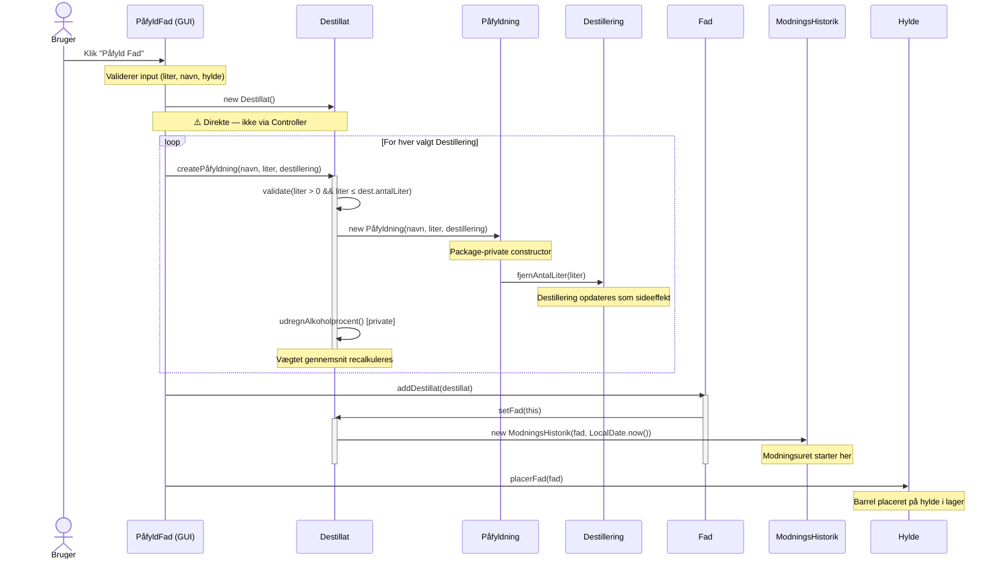
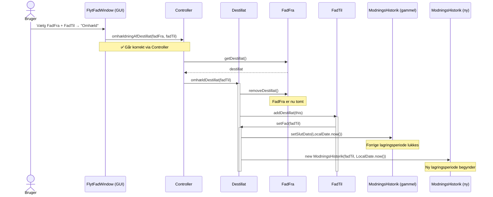

# Case-forberedelse: 2. samtale — Sall Whisky Destilleri

> Primært kode-eksempel: `Destillat.java`
> Rød tråd: **Rig domænemodel vs. anæmisk domænemodel**

---

## SLIDE 1 — Kontekst og problemstilling

**Titel:** Sall Whisky Destilleri — Digital sporbarhed fra korn til flaske

**Indhold:**
- Eksamensprojekt, 3. semester Datamatiker — gruppe på [X] personer
- Mit primære ansvar: [fx domænemodellen / Controller-laget / ...]
- **Problemet:** Destilleriet manglede digital sporbarhed — hvem lavede hvad, hvornår, og hvilke fade har destillatet ligget i?
- **Stack:** Java 19 · JavaFX · JUnit 5 · Object serialization (ingen database, ingen framework)

**Talepunkter:**
> "Applikationen dækker hele produktionskæden: fra hvilken kornsort der er brugt, over destillering og påfyldning i fade, til lagerstyring og til sidst flaskning med automatisk genereret produkthistorie.
> Ingen Spring, ingen database — vi valgte at serialisere Java-objekterne direkte til disk."

---

## SLIDE 2 — Arkitektur

**Titel:** 3-lags arkitektur — manuelt implementeret

**Diagram (tegn det op):**
```
┌──────────────────────────────────┐
│  GUI  (JavaFX Panes / Dialogs)   │
└────────────────┬─────────────────┘
                 │ kalder Controller.*
┌────────────────▼─────────────────┐
│  Controller  (static abstract)   │  ← Service Layer
└────────────────┬─────────────────┘
                 │ delegerer til
┌────────────────▼─────────────────┐
│  Storage  (interface)            │
│  └── ListStorage (ArrayList+srl) │  ← Repository Layer
└──────────────────────────────────┘
```

**Indhold:**
- `Controller` er en `abstract class` med **kun static metoder** — GUI kalder altid `Controller.*`
- `Storage` er et **interface** injiceret via `Controller.setStorage(storage)` ved opstart
- `ListStorage` bruger Java-serialisering til én `.srl`-fil

**Talepunkter:**
> "Det er et manuelt implementeret 3-lags mønster — ingen framework. Controller svarer til det der i Spring ville hedde et Service Layer. Det vigtige er Storage-interfacet: ved at injicere implementationen kan vi udskifte den — f.eks. med en mock i tests."

> "En ting jeg ville gøre anderledes: Controller er `abstract` med `static` metoder. Det giver ingen mening — `abstract` er der for at nedarves, og det gør ingen. Det burde enten være en `final class` med privat konstruktør, eller helst en instans-baseret service, så den kan unit-testes med dependency injection."

---

## SLIDE 3 — Domænemodel

**Titel:** Domænemodel — whiskyens rejse som objekter

**Diagram:**
```
Korn ──────────────────────────────────────────────────┐
                                                        │
Destillering ←─── maltbatch, korn, medarbejder, ABV   │
     │                                                  │
     ▼ (via)                                            │
  Påfyldning ──────────────────────────────────────────┘
     │
     ▼ (opbygger)
  Destillat ──── alkoholprocent (beregnet), antalLiter
     │     └──── ModningsHistorik (én per fad)
     │
     ▼ (placeres i)
   Fad ──── FadHistorik (tidligere indhold)
     │
     ▼ (via)
  Hylde → Reol → Lager
     │
     ▼ (tappes til)
  FadTapning
     │
     ▼ (indgår i)
  WhiskyProdukt ──── whiskyType(), genererHistorie()
     │
     ▼
  WhiskyFlaske (én per liter)
```

**Talepunkter:**
> "Modellen afspejler det faktiske domæne. Et Destillat er det umodne whisky — det kan være sammensat af påfyldninger fra flere forskellige destilleringer, og det vandrer gennem fade og efterlader sporbarhed via ModningsHistorik."

---

## SLIDE 4 — Rig domænemodel (PRIMÆR KODE-SLIDE)

**Titel:** Rig domænemodel — forretningslogikken bor i entiteterne

**Vis `Destillat.java` i IDE'et, og gennemgå fire punkter:**

### Punkt 1 — Factory method med validering (`linje 36-46`)
```java
public Påfyldning createPåfyldning(String medarbejderNavn,
                                    double literPåfyldt,
                                    Destillering dest) {
    if (literPåfyldt <= 0 || literPåfyldt > dest.getAntalLiter()) {
        throw new IllegalArgumentException("Invalid volume for påfyldning.");
    }
    Påfyldning pf = new Påfyldning(medarbejderNavn, literPåfyldt, dest);
    påfyldninger.add(pf);
    antalLiter += pf.getLiterPåfyldt();
    udregnAlkoholprocent();
    return pf;
}
```
> "`Påfyldning` har en package-private konstruktør — den kan kun oprettes her, inde fra `Destillat`. Det er compileren der håndhæver invarianten, ikke dokumentation."

### Punkt 2 — Privat beregning, altid konsistent (`linje 157-163`)
```java
private void udregnAlkoholprocent() {
    double literEthanol = 0;
    for (Påfyldning påfyldning : påfyldninger) {
        literEthanol += (påfyldning.getDestillering().getAlkoholProcent() / 100)
                        * påfyldning.getLiterPåfyldt();
    }
    alkoholprocent = (literEthanol / antalLiter) * 100;
}
```
> "Vægtet gennemsnit — liter ethanol divideret med total liter. Det interessante er at den er `private` og kaldes automatisk fra `createPåfyldning()`. Tilstanden kan aldrig blive inkonsistent."

### Punkt 3 — Domæneregel tæt på data (`linje 170-176`)
```java
public boolean destillatKlar() {
    Period p = Period.between(
        modningsHistorik.get(0).getPåfyldningsDato(),
        LocalDate.now()
    );
    return p.getYears() >= 3;
}
```
> "Tre-årsreglen for whisky bor i selve entiteten — ikke i en service eller i GUI'en. Det er kernen i den rige domænemodel."

### Punkt 4 — Automatisk historiksporing (`linje 143-155`)
```java
public void setFad(Fad fad) {
    this.fad = fad;
    createModningsHistorik();  // <-- altid
}

private ModningsHistorik createModningsHistorik() {
    if (this.modningsHistorik.size() > 0) {
        // Luk forrige periode
        this.modningsHistorik.get(this.modningsHistorik.size() - 1)
            .setSlutDato(LocalDate.now());
    }
    ModningsHistorik mh = new ModningsHistorik(fad, LocalDate.now());
    this.modningsHistorik.add(mh);
    return mh;
}
```
> "Hver gang et destillat flyttes til et nyt fad — om det er første gang eller en omhældning — lukkes forrige periode automatisk og der oprettes en ny. Det er umuligt at glemme det."

---

## SLIDE 5 — Selvkritik

**Titel:** Hvad ville jeg gøre anderledes?

| Problem | Konsekvens | Løsning |
|---|---|---|
| `static Controller` | Kan ikke unit-testes med DI | Instans-baseret service med interface |
| GUI kalder model direkte (`PåfyldFad.java`) | 3-lags arkitektur brydes inkonsistent | Alt GUI→model-kommunikation via Controller |
| `int literEthanol` i `WhiskyProdukt` | Stille precision-bug — afkorter til heltal | `double literEthanol` |
| Triple nested loop i `createFadTapning()` | O(n³) søgning efter en hylde | Omvendt reference: Destillat → Hylde |
| Object serialization | Ingen migrations-path; bryder ved rename | JPA + rigtig database |
| Ingen transaktioner | Halvt gennemført operation = korrupt state | Unit of work / transaktionsgrænser |

**Det der virker godt:**
- `Storage` som interface → kan mockes i tests → og det bruger vi i `ModelsTest.java`
- Package-private konstruktører (`Påfyldning`, `FadTapning`) → invarianter håndhæves af compileren
- Defensive copies i getters: `return new ArrayList<>(påfyldninger)` → ekstern kode kan ikke mutere intern tilstand

**Talepunkter:**
> "En ting jeg faktisk ikke opdagede mens jeg skrev det: `int literEthanol` i `WhiskyProdukt.udregnAlkoholprocent()` er en præcisionsfejl — al ethanol afrundes til heltal før divisionen, så ABV beregnes forkert for blandingsprodukter. I `Destillat` er det korrekt med `double`. Det er den slags fejl man opdager, når man skriver tests."

> "GUI'en i `PåfyldFad` springer Controller over og kalder direkte `destillat.createPåfyldning()` og `fad.addDestillat()`. Det er inkonsistent — Controller har faktisk metoder til det, men de bruges ikke. Det bryder lagdelingen."

---

## SUPPLEMENT — Validering og fejlhåndtering

### Validering

| | Original (JavaFX) | Spring Boot |
|---|---|---|
| **Model-niveau** | `IllegalArgumentException` i `Destillat.createPåfyldning()` — tjekker `liter > 0` og `liter ≤ dest.antalLiter` | Service kaster `IllegalStateException` i `sletFad()` (kun tomme fade) og `tapFad()` (kun klar destillat) |
| **GUI/API-niveau** | `PåfyldFad` validerer hvert felt manuelt — tomme felter, ugyldig volume, overskredet kapacitet — og viser `Alert`-dialogs | Spring MVC konverterer unchecked exceptions til HTTP 500 automatisk — ingen `@Valid` eller Bean Validation annotationer |
| **Konsistens** | Inkonsistent: noget validering i GUI, noget i modeller, intet i Controller | Inkonsistent: ingen systematisk valideringsstrategi, heller ingen `@ControllerAdvice` |

**Hvad burde have været gjort:**
- **Original:** Validering burde samles i Controller (service-laget) — ikke spredt over GUI og modeller
- **Spring Boot:** `@Valid` + Jakarta Bean Validation på request-DTOs (`@NotNull`, `@Positive`), og en global `@ControllerAdvice` der returnerer strukturerede fejl-responses i stedet for 500

**Talepunkter:**
> "Vi validerede i `createPåfyldning()` med en `IllegalArgumentException` — det er et skridt i den rigtige retning, men der er ikke en systematisk strategi. GUI'en validerer separat, Controller validerer ikke. I Spring Boot-versionen mangler vi både Bean Validation på DTOs og en global exception handler. Det ville jeg prioritere tidligt i et rigtigt projekt."

---

### Fejlhåndtering

| | Original (JavaFX) | Spring Boot |
|---|---|---|
| **Persistence-fejl** | `e.printStackTrace()` i `gemProduktHistorieTilFil()` — fejlen sluges | Ingen eksplicit fejlhåndtering i repositories; JPA kaster `DataAccessException` der bobler op |
| **Forretningsfejl** | `IllegalArgumentException` i models — ikke fanget systematisk | `IllegalStateException` fra services — Spring returnerer 500, ingen fejl-body |
| **Global handler** | Ingen | Ingen `@ControllerAdvice` / `@ExceptionHandler` |

**Talepunkter:**
> "`e.printStackTrace()` i `gemProduktHistorieTilFil()` er en klassisk fejl fra studietiden — fejlen er tabt, brugeren ved ikke hvad der skete, og der er ingen recovery. I Spring Boot-versionen mangler der en `@ControllerAdvice` der fanger exceptions og returnerer et struktureret JSON-svar med fejlkode og besked — ellers er API'et svært at konsumere fra frontend."

---

## SUPPLEMENT — Logging og sikkerhed

### Logging

| | Original (JavaFX) | Spring Boot |
|---|---|---|
| **Applikationslogning** | Ingen — hverken `java.util.logging`, Log4j eller andet | Standard Spring Boot startup-logs aktive, men ingen applikations-specifik logning |
| **Forretningshændelser** | Ingen spor af hvem der oprettede hvad hvornår (udover domæneobjekternes egne felter) | Ingen `@Slf4j` / `log.info()` i services eller controllers |

**Hvad burde have været gjort:**
```java
// Eksempel på hvad der burde logges i FadService
@Slf4j
@Service
public class FadService {
    public FadResponse paafyldFad(UUID fadId, PaafyldFadRequest req) {
        log.info("Påfylder fad {} med {} destilleringer", fadId, req.paafyldninger().size());
        // ...
        log.info("Fad {} fyldt — destillat oprettet med ABV {}", fadId, destillat.getAlkoholProcent());
    }
}
```

**Talepunkter:**
> "Ingen af versionerne har logging, og det er en klar mangel. I produktion ville man som minimum logge vigtige forretningshændelser — 'fad tappet', 'omhældning foretaget', 'whisky flasket' — så man kan debugge og auditere. `@Slf4j` fra Lombok giver det med én annotation."

---

### Sikkerhed

| | Original (JavaFX) | Spring Boot |
|---|---|---|
| **Authentication** | Hardcoded `"admin".equals(input)` i `LoginPane` — simpel string-sammenligning | HTTP Basic Auth via `SecurityConfig` — in-memory bruger `admin/admin` |
| **Password** | Plaintext i kildekode | Plaintext i kildekode — ingen hashing |
| **Transport** | N/A (desktop-app, ingen netværk) | HTTP — ingen HTTPS tvunget |
| **Autorisation** | Én bruger, ingen roller | Én bruger, ingen roller |

**Talepunkter:**
> "I den originale version er 'sikkerhed' reelt en if-sætning med hardcoded strenge — det er acceptabelt for en lokal desktop-eksamen, men ikke andet. I Spring Boot-versionen er der Basic Auth og Spring Security, men stadig hardcoded `admin/admin` i kildekode. I produktion ville man have BCrypt-hashede passwords, credentials i environment variables, HTTPS, og sandsynligvis JWT frem for Basic Auth."

> "Det er en bevidst trade-off for et skoleeksamensprojekt — vi prioriterede funktionalitet over sikkerhed. Det ville have been anderledes i en produktionskontekst."

---

## SUPPLEMENT — Test

| | Original (JavaFX) | Spring Boot |
|---|---|---|
| **Testtype** | Unit tests (JUnit 5) | Unit/integration tests (JUnit 5 + Spring Boot Test) |
| **Fil** | `Test/application/models/ModelsTest.java` | `backend/src/test/` |
| **Dækning** | Domænelogik i isolation | — |

### Hvad `ModelsTest.java` dækker (original):
- Fad + Destillat livscyklus (opret, fyld, tøm)
- Påfyldning-oprettelse og liter-tracking på Destillering
- Re-barreling (omhælding) og ModningsHistorik-entries
- `destillatKlar()` efter 3 år
- ABV-beregning (vægtet gennemsnit)
- `whiskyType()` — Cask Strength → Single Cask → Single Malt

### Hvad der IKKE er testet (original):
- GUI (ingen JavaFX-tests)
- Serialisering og deserialisering af `storage.srl`
- `static Controller`-metoder (ikke unit-testbare med DI)
- Negativ-tests — hvad sker der ved `null`-input, 0 liter, overskredet kapacitet i edge cases?
- `genererHistorie()` — kompleks output-logik, aldrig testet

### Hvad der burde have været gjort:
```java
// Eksempel på manglende negativ-test
@Test
void createPåfyldning_overMaxLiter_shouldThrow() {
    Destillering dest = new Destillering(/* 100L kapacitet */);
    Destillat destillat = new Destillat();

    assertThrows(IllegalArgumentException.class,
        () -> destillat.createPåfyldning("Lars", 150.0, dest));
}
```

**Talepunkter:**
> "Vi har unit-tests på domænelogikken, og Storage-interfacet er designet til at kunne mockes — men vi brugte det aldrig til at teste Controller-metoderne. Og `static` Controller er reelt umulig at unit-teste isoleret. Det er en direkte konsekvens af det statiske design."

> "Det der mangler mest er en test der viser at serialisering og deserialisering bevarer tilstanden korrekt — det er jo vores persistence-lag, og det er aldrig testet. Hvis vi havde haft den test, ville vi have opdaget det potentielle problem med static counters tidligere."

---

## SUPPLEMENT — Hvad gør koden nem/svær at videreudvikle?

### Nem at videreudvikle (original):
- **Storage-interfacet** — ny persistence-implementation (f.eks. SQL) kan swappes ind uden at røre resten
- **ModningsHistorik** — komplet sporbarhed er bygget ind fra starten; ny rapportering kræver ingen strukturelle ændringer
- **Rig model** — domænelogik er samlet og selvdokumenterende; ny forretningsregel tilføjes ét sted

### Svær at videreudvikle (original):
- **Static Controller** — ingen DI, ingen mulighed for at have separate instanser (f.eks. multi-user)
- **Serialization** — tilføj et nyt felt til en klasse → ingen automatisk migration; alle eksisterende `.srl`-filer er potentielt korrupte
- **Ingen transaktioner** — ny feature der involverer to operationer kræver manuel rollback-logik
- **GUI der kalder modeller direkte** — refaktorering af modellerne kræver ændringer i GUI-kode man ikke nødvendigvis ved eksisterer

**Talepunkter:**
> "Storage-interfacet er det bedste arkitekturvalg vi gjorde — det er den ene ting der er let at bygge videre på. Alt andet kræver større refaktorering. Serialisering er det der ville vokse sig til et reelt problem hurtigst, fordi man ved første domæneændring enten skal skrive migreringslogik eller miste alle eksisterende data."

---

## SUPPLEMENT — Overdragelse til en anden udvikler

**Hvad jeg ville gøre:**

1. **Start med arkitekturdiagrammet** (Slide 2) — "Tre lag: GUI kalder altid Controller, Controller delegerer til Storage. Husk: Controller er static, Storage er interface."
2. **Vis domænemodellen** (Slide 3) — "Destillat er omdrejningspunktet. Alt kredserer om det."
3. **Gennemgå sekvensdiagrammet for påfyldning** — det er den mest komplekse operation og viser samspillet mellem alle lag på én gang
4. **Peg på tre kritiske ting at vide:**
    - `PåfyldFad` kalder modeller direkte (ikke via Controller) — det er inkonsistent, lad være med at kopiere det mønster
    - `static` counters i `Fad` og `Destillering` — de gemmes/gendannes manuelt i `ListStorage`, touch dem ikke uden at forstå det
    - `storage.srl` i working directory — delete den for at resette til sample data

**Talepunkter:**
> "Til overdragelse er de to sekvensdiagrammer faktisk det vigtigste artefakt — de viser ikke bare hvad der sker, men også *hvem* der har ansvar for hvad. En ny udvikler kan se at omhældning går via Controller (korrekt) men påfyldning ikke (fejl), og have en kvalificeret diskussion om hvorfor."

---

## SLIDE 6 — Rig vs. anæmisk model / Spring Boot

**Titel:** Samme domæne — to arkitekturvalg

### Den overraskende pointe: Spring Boot-versionen er HYBRID

Det er ikke et rent skift fra rig til anæmisk. Tommelfingerreglen der opstod:

| Logik-type | Hvor den bor | Eksempel |
|---|---|---|
| Ren beregning, ét objekt | **Entitet** | `erKlar()`, `udregnAlkoholProcent()`, `whiskyType()` |
| Orkestration på tværs af entiteter | **Service** | `tapFad()`, `omhaeldDestillat()` |
| Validering af forretningsinvarianter | **Service** (kaster exception) | `tapFad()` tjekker `erKlar()` før det er for sent |

---

### Sammenligning 1 — `destillatKlar()` vs. `erKlar()`

**Original (`Destillat.java` i JavaFX):**
```java
// Checker første ModningsHistorik-entries dato
public boolean destillatKlar() {
    Period p = Period.between(
        modningsHistorik.get(0).getPåfyldningsDato(),
        LocalDate.now()
    );
    return p.getYears() >= 3;
}
```

**Spring Boot (`Destillat.java` i backend):**
```java
// Checker startDato direkte på entiteten
public boolean erKlar() {
    if (startDato == null) return false;
    return Period.between(startDato, LocalDate.now()).getYears() >= 3;
}
```

Logikken bor stadig i **entiteten** i begge versioner — men Spring Boot-versionen er simplere og mere null-sikker. Den originale ville kaste `IndexOutOfBoundsException` på `get(0)` hvis ingen historik fandtes.

---

### Sammenligning 2 — ABV-beregning: bug rettet

**Original (`WhiskyProdukt.java`) — BUG:**
```java
private void udregnAlkoholprocent() {
    int literEthanol = 0;  // ← int! Præcisionstab
    for (FadTapning fadTapning : fadTapninger) {
        literEthanol += (fadTapning.getDestillat().getAlkoholprocent() / 100)
                        * fadTapning.getLiterTappet();
    }
    alkoholprocent = ((literEthanol / antalLiter) * 100);
}
```

**Spring Boot (`WhiskyProdukt.java`) — rettet:**
```java
public void udregnAlkoholProcent() {
    double literEthanol = fadTapninger.stream()  // ← double + streams
            .mapToDouble(ft -> (ft.getDestillat().getAlkoholProcent() / 100.0)
                               * ft.getLiterTappet())
            .sum();
    alkoholProcent = antalLiter > 0 ? (literEthanol / antalLiter) * 100.0 : 0;
}
```
`int literEthanol` er en stille bug: 81,5% ABV afrundes til 81 — fejlen akkumuleres over alle taps. I Spring Boot er det rettet til `double` og skrevet med streams.

---

### Sammenligning 3 — Re-barreling: fra entitet til service

**Original — logik i entiteten (`Destillat.java`):**
```java
// Entitetens eget ansvar at flytte sig selv
public void omhældDestillat(Fad newFad) {
    this.fad.removeDestillat();
    newFad.addDestillat(this);  // → setFad() → createModningsHistorik()
}
```

**Spring Boot — logik i servicen (`FadService.java`):**
```java
public void omhaeldDestillat(UUID fadFraId, UUID fadTilId) {
    // Luk den åbne periode i det gamle fad
    destillat.getModningsHistorik().stream()
            .filter(h -> h.getSlutDato() == null)
            .forEach(h -> h.setSlutDato(LocalDate.now()));

    // Flyt destillat
    fadFra.setDestillat(null);
    fadTil.setDestillat(destillat);

    // Åbn ny periode i det nye fad
    ModningsHistorik ny = new ModningsHistorik(destillat, fadTil, LocalDate.now());
    destillat.getModningsHistorik().add(ny);
}
```

**Hvorfor?** Servicen kan tilgå to repositories (`fadFra` og `fadTil`), håndtere transaktionen og validere at `fadTil` er tomt. Entiteten kan ikke det — den kender ikke til JPA-konteksten.

---

### Sammenligning 4 — DTOs: API-kontrakt adskilt fra domæne

**Original:** GUI arbejdede direkte med domæneobjekter — ingen adskillelse.

**Spring Boot — Java records som DTOs:**
```java
// Request (hvad klienten sender)
public record PaafyldFadRequest(
    List<PaafyldningEntry> paafyldninger
) {
    public record PaafyldningEntry(
        UUID destilleringId, double liter, String medarbejder
    ) {}
}

// Response (hvad API'et returnerer)
public record FadResponse(
    UUID fadId, String fadNummer, int literKapacitet,
    String tidligereIndhold, boolean erKlar,
    DestillatSummary destillat,    // ← nested, kun det der er relevant
    HyldePlacering hylde
) {}
```

Fordelen: Entiteten kan ændres internt (f.eks. nye felter, JPA-annotationer) uden at bryde API-kontrakten. Og vi eksponerer kun de data klienten behøver.

---

### Den egentlige JPA-udfordring med rig domænemodel

JPA's reelle problem med rig model er ikke "logik i entiteter" generelt — det er **logik der traverserer lazy-loadede collections** udenfor en åben JPA-session:

```java
// whiskyType() i WhiskyProdukt — RISIKABELT
public String whiskyType() {
    if (fadTapninger.size() == 1) {                            // @OneToMany — lazy!
        Destillat d = fadTapninger.get(0).getDestillat();
        if (d.getModningsHistorik().size() == 1) { ... }      // endnu en lazy collection
    }
}
```

Kaldes dette udenfor en aktiv JPA-session → `LazyInitializationException`.

Til sammenligning er `erKlar()` **uproblematisk** — den checker kun `startDato`, et simpelt felt.

| Metode | Problem? | Årsag |
|---|---|---|
| `erKlar()` — checker `startDato` | Nej | Simpelt felt, ingen collections |
| `whiskyType()` — traverserer `fadTapninger` | Ja | Lazy-loaded collection |
| `udregnAlkoholProcent()` — traverserer `paafyldninger` | Ja | Lazy-loaded collection |

I dette projekt virker det sandsynligvis fordi collections altid hentes inden for en service-metodes transaktion — men det er tilfældigt, ikke by design. En mere korrekt løsning ville flytte `whiskyType()` og `udregnAlkoholProcent()` til servicen.

---

### Talepunkter:

> "Da jeg lavede Spring Boot-versionen beholdt jeg en del logik i entiteterne — `erKlar()`, `whiskyType()`, ABV-beregning. Men ser man nærmere på det, er det faktisk ikke uproblematisk: `whiskyType()` og `udregnAlkoholProcent()` traverserer lazy-loadede collections. Det er JPA's klassiske faldgrube — hvis de metoderne kaldes udenfor en åben session, kaster de `LazyInitializationException`."

> "Den metode der reelt er sikker i entiteten er `erKlar()` — den checker kun et simpelt datofelt. Resten burde nok flyttes til servicen, eller man skulle gøre collections EAGER — hvilket har sine egne performancekonsekvenser."

> "Så det ærlige svar er: Spring Boot-versionen er ikke fuldt gennemtænkt i det valg. Man skal enten committe til rig model og håndtere lazy-loading eksplicit, eller gå anæmisk og lægge al logik i services. At sidde midt imellem er det farligste sted."

> "Jeg fandt også en fejl i selve implementationen: `int literEthanol` i WhiskyProdukt. Det opdagede jeg da jeg sammenlignede de to versioner. Det er den slags fejl man finder ved at skrive tests — eller ved at lave en reimplementering og tvinge sig selv til at gennemtænke typer."

> "DTOs er noget vi slet ikke havde i den originale version — GUI'en fik bare fat i domæneobjekterne direkte. I Spring Boot separerer vi API-kontrakten med Java records, og det giver fleksibilitet til at ændre domænet uden at bryde frontend."

---

## SEKVENSDIAGRAM 1 — Påfyldning af fad



---

## SEKVENSDIAGRAM 2 — Omhældning (re-barreling)



---

## Svære spørgsmål — forbered svar

1. **"Hvem lavede hvad i gruppen?"** — Vær konkret om dit eget bidrag
2. **"Hvorfor `abstract class` og ikke `interface` til Controller?"** — Det giver ingen mening; muligvis et reflex fra en undervisers template; bedre: `final class` med privat konstruktør, eller instans-baseret service
3. **"Hvorfor object serialization frem for en database?"** — Pragmatisk valg for desktop-app, ingen server-afhængighed; men svagt til videreudvikling
4. **"Hvad er en rig domænemodel?"** — Forretningslogikken bor i entiteterne selv, ikke i separate service-klasser. Fordel: udtryksfuldt, lokalt konsistent. Ulempe: svær at persistere, svær at dele på tværs af bounded contexts
5. **"Hvad ville din næste iteration have indeholdt?"** — Transaktioner, bedre test-coverage, domæne-events, en rigtig database
6. **"Hvad er et DTO og hvorfor?"** — Data Transfer Object: en simpel dataholder der adskiller API-kontrakten fra domænet. Undgår at eksponere intern domænestruktur; giver fleksibilitet til at ændre det ene uden at påvirke det andet.
7. **"Er Spring Boot-versionen anæmisk?"** — Delvist, men ikke konsekvent. `erKlar()` er fint i entiteten — simpelt felt, ingen lazy collections. Men `whiskyType()` og `udregnAlkoholProcent()` traverserer `@OneToMany`-collections, som er lazy-loaded. De burde flyttes til servicen for at undgå `LazyInitializationException` udenfor JPA-sessionen. Projektet sidder lidt midt imellem, og det er faktisk det farligste sted at sidde.
8. **"Hvad er en `@Transactional`?"** — En annotation der markerer at en service-metode skal køre i én database-transaktion. Enten lykkes hele operationen, eller rulles alt tilbage. F.eks. ved re-barreling: hvis noget fejler halvvejs, ender vi ikke med et destillat der er fjernet fra det ene fad uden at være tilføjet det andet.

---

## Kritiske filer at kende

**Original (JavaFX):**

| Fil | Formål |
|-----|--------|
| `src/application/models/Destillat.java` | Primært kode-eksempel |
| `src/application/models/WhiskyProdukt.java` | `whiskyType()`, `genererHistorie()`, ABV-bug |
| `src/application/controller/Controller.java` | Service-laget; static-problemet |
| `src/application/controller/Storage.java` | Interface; DI-mønsteret |
| `src/storage/ListStorage.java` | Serialisering; counter-restore |
| `Test/application/models/ModelsTest.java` | Test-strategi og -dækning |
| `src/gui/PåfyldFad.java` | GUI der bypasser Controller (arkitektur-inkonsistens) |

**Spring Boot (sammenligning):**

| Fil | Formål |
|-----|--------|
| `backend/.../domain/entity/Destillat.java` | `erKlar()` — logik stadig i entitet, men simplere + null-sikker |
| `backend/.../domain/entity/WhiskyProdukt.java` | `whiskyType()` — stadig i entitet; ABV-bug rettet til `double` |
| `backend/.../domain/service/FadService.java` | `omhaeldDestillat()` — re-barreling flyttet til service |
| `backend/.../domain/service/WhiskyService.java` | `tapFad()` — validerer `erKlar()` og orkestrer tapning |
| `backend/.../domain/repository/FadRepository.java` | Custom JPQL-queries for tomme/fyldte/klar fade |
| `backend/.../api/dto/request/PaafyldFadRequest.java` | DTO-eksempel: API-kontrakt adskilt fra domæne |
| `backend/.../api/dto/response/FadResponse.java` | Response-DTO: nested records, kun relevant data eksponeret |

---

## Feedback på casen som samtaleværktøj

*(Casen beder eksplicit om dette — notér dine tanker)*

- **Styrke:** Åbner for både teknisk og refleksiv dialog
- **Styrke:** "Frit metodevalg" giver kandidaten mulighed for at vise sig selv
- **Observation:** "Backend-delen spiller en central rolle" kan være svær at efterleve for uddannelsesprojekter der ikke bruger Spring — overvej at nævne dette og brug det som anledning til at tale om Spring Boot-rewritet
