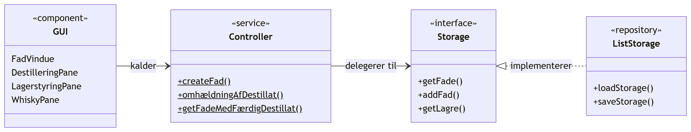
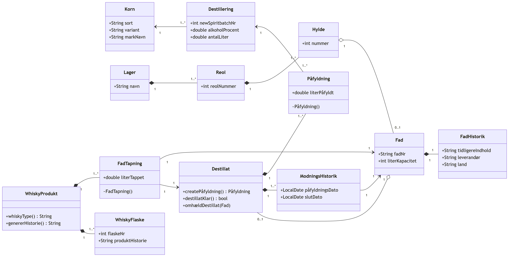
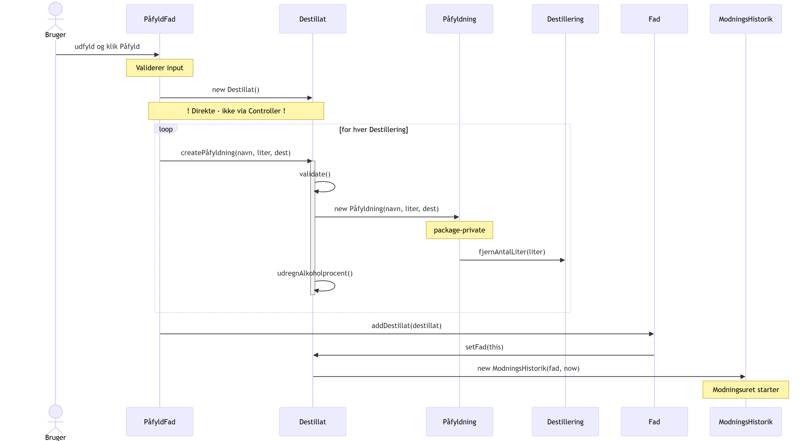
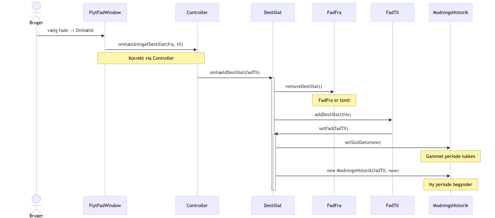

<!-- _class: title-slide -->

# Case: Sall Whisky Destilleri

### Digital sporbarhed fra korn til flaske

<p>3. semester eksamensprojekt &nbsp;·&nbsp; Java 19 &nbsp;·&nbsp; JavaFX &nbsp;·&nbsp; JUnit 5</p>

---

<!-- _class: section-header -->

# Kontekst og problemstilling

Hvad er problemet, og hvem løste det?

---

<!-- Slide 1 - Kontekst og problemstilling / Hvilket problem? -->

# Hvilket problem løser koden?

<div class="case-label">Kontekst og problemstilling</div>

**Destilleriet manglede digital sporbarhed:**

- Hvem lavede hvilken destillering, og hvornår?
- Hvilke fade har et destillat ligget i - og i hvor lang tid?
- Hvor er fadene fra og hvilken type er de?
- Er whisky'en klar til flaskning (≥ 3 år gammel)?

**Applikationen dækker hele kæden:**

> Korn → Destillering → Påfyldning → Fad → Lager → Tapning → Flaskning

**Stack:** Java 19 · JavaFX · JUnit 5 · Object serialization (ingen database, ingen framework)

<!--
Talepunkt: "Ingen Spring, ingen database - vi valgte at serialisere Java-objekterne direkte til disk.
Det er en pragmatisk beslutning for en lokal desktop-app, men den har konsekvenser vi vender tilbage til."
-->

---

<!-- Slide 2 - Kontekst og problemstilling / Hvem arbejdede du med? -->

# Hvem arbejdede jeg sammen med?

<div class="case-label">Kontekst og problemstilling</div>

<div class="cols">
<div>

**Gruppe:** 3 personer - 3. semester Datamatiker

**Mit primære ansvar:**
- Datamodellering og domænemodel (UML, klassediagrammer)
- Størstedelen af backend-logikken
- Design-beslutninger og rapport

</div>
<div>

**Arbejdsform:**
- Vandfaldsmodel
- Fordelt arbejde: GUI vs. backend
- Fælles review af domænemodellen

</div>
</div>

<!--
Talepunkt: "Samarbejdet var udfordrende - jeg endte med at stå for det meste af
domænemodellen, designbeslutningerne og rapporten. Det gav mig et godt overblik
over hele systemet, men det var også en lære i at tydeliggøre arbejdsfordeling
fra starten."
-->

---

<!-- _class: section-header -->

# Tekniske valg og overvejelser

Arkitektur · Datamodellering · Validering · Sikkerhed

---

<!-- Slide 3 - Tekniske valg / Arkitektur (UML Component Diagram) -->
<!-- _class: diagram-slide -->

# Arkitektur - 3-lags, manuelt implementeret

<div class="case-label">Tekniske valg og overvejelser · Hvorfor er koden struktureret som den er?</div>



<!--
"Storage er et interface injiceret ved opstart - kan mockes i tests.
Controller svarer til et Service Layer, men er static - det vender vi tilbage til som selvkritik."
-->

---

<!-- Slide 4 - Tekniske valg / Domænemodel (UML Class Diagram) -->
<!-- _class: diagram-slide -->

# Domænemodel

<div class="case-label">Tekniske valg og overvejelser · Hvordan modellerede jeg data?</div>



<!--
"Destillat er omdrejningspunktet - det binder destillering, fade og sporbarhed sammen.
Vi brugte ingen DTOs: GUI'en arbejdede direkte med domæneobjekterne."
-->

---

<!-- Slide 5 - Tekniske valg / Rig domænemodel -->

# Rig domænemodel: forretningslogikken i entiteterne

<div class="case-label">Tekniske valg og overvejelser · Datamodellering</div>

<div class="cols">
<div>

**Factory method - invariant via compileren**
```java
// Påfyldning har package-private constructor
// → kan kun oprettes her
public Påfyldning createPåfyldning(
        String navn, double liter, Destillering dest) {

    if (liter <= 0 || liter > dest.getAntalLiter())
        throw new IllegalArgumentException();

    Påfyldning pf = new Påfyldning(navn, liter, dest);
    påfyldninger.add(pf);              // ← ejer listen
    antalLiter += pf.getLiterPåfyldt();
    udregnAlkoholprocent(); // ← privat, auto-kaldt
    return pf;
}
```

</div>
<div>

**Domæneregel tæt på data**
```java
public boolean destillatKlar() {
    return Period.between(
        modningsHistorik.get(0)
            .getPåfyldningsDato(),
        LocalDate.now()
    ).getYears() >= 3;
}
```

**Sporbarhed, umulig at glemme**
```java
public void setFad(Fad fad) {
    this.fad = fad;
    createModningsHistorik(); // altid
}
```

</div>
</div>

<!--
Factory method: "Påfyldning kan kun oprettes via createPåfyldning — konstruktøren er package-private,
så det er compileren der håndhæver invarianten, ikke kommentarer eller dokumentation."

destillatKlar(): "3-årsreglen sidder direkte i entiteten. Den kigger altid på den rigtige dato
fra første ModningsHistorik-entry — man kan ikke kalde den forkert."

setFad(): "Hver gang et fad skiftes, oprettes en ny ModningsHistorik-post automatisk.
Man kan simpelthen ikke glemme at registrere det — det sker altid."
-->

---

<!-- Slide 6 - Tekniske valg / Validering, fejl, logging, sikkerhed -->

# Validering, fejl, logging og sikkerhed

<div class="case-label">Tekniske valg og overvejelser</div>

<div class="cols">
<div class="box bad">

**Hvad vi HAR**

- Model: `IllegalArgumentException` i `createPåfyldning()`
- GUI: Manuel validering i `PåfyldFad` (volume, tomme felter)
- Auth: `"admin".equals(input)` i `LoginPane`
- Fejl: `e.printStackTrace()` i fil-skrivning

</div>
<div class="box">

**Hvad der mangler**

- Validering er **inkonsistent** - spredt over GUI og model, intet i Controller
- **Ingen logging** - hverken java.util.logging, Log4j eller andet
- **Ingen global fejlhåndtering** - fejl sluges eller bobler ukontrolleret
- Hardcoded credentials i kildekoden

</div>
</div>

> I produktion: validering samlet i service-laget, `@Slf4j` på forretningshændelser, struktureret fejl-respons.

<!--
"Valideringen er inkonsistent — noget sidder i GUI, noget i modellen, intet i Controller.
Kalder man Controller direkte fra en anden kontekst, er der ingen garanti for at data er gyldigt."

"admin/admin hardcoded i LoginPane — indlysende problematisk, men acceptabelt for et lukket
skoleprojekt uden netværksforbindelse. I produktion: credentials udenfor kildekoden, hashed passwords."
-->

---

<!-- _class: section-header -->

# Kvalitet og vedligeholdelse

Test · Læsbarhed · Genbrug · Videreudvikling

---

<!-- Slide 7 - Kvalitet / Test -->

# Test

<div class="case-label">Kvalitet og vedligeholdelse · Hvordan har jeg tænkt test ind?</div>

<div class="cols">
<div class="box good">

**`ModelsTest.java` dækker:**

- Fad + Destillat livscyklus
- Påfyldning og liter-tracking
- Re-barreling + ModningsHistorik
- `destillatKlar()` (3-årsregel)
- ABV vægtet gennemsnit
- `whiskyType()` klassifikation

</div>
<div class="box bad">

**Mangler:**

- GUI-tests
- Serialisering/deserialisering
- Controller-metoder *(static = ikke testbar med DI)*
- Negativ-tests og edge cases
- `genererHistorie()` output

</div>
</div>

> `Storage` er interface → kan mockes. Men vi brugte det aldrig til at teste Controller.
> Det er en direkte konsekvens af det statiske design.

<!--
"ModelsTest.java tester domæne-laget direkte — vi sætter Storage op med ListStorage i testen,
og kører forretningslogikken igennem. Det virker fordi Storage er et interface."

"Controller kunne ikke testes på samme måde — static betyder at man ikke kan injecte en mock.
Det er den direkte konsekvens af designvalget, og det opdagede vi undervejs."
-->

---

<!-- Slide 8 - Kvalitet / Læsbarhed, genbrug, videreudvikling -->

# Læsbarhed, genbrug og videreudvikling

<div class="case-label">Kvalitet og vedligeholdelse</div>

<div class="cols">
<div>

**✅ Virker godt**

- Package-private constructors → invarianter via compileren
- `return new ArrayList<>(liste)` → intern tilstand kan ikke muteres
- Metodenavne følger domænet: `omhældDestillat`, `destillatKlar`
- `Storage`-interface → kan swappes uden at røre resten

</div>
<div>

**❌ Virker ikke**

- `int literEthanol` i `WhiskyProdukt` - ABV-formlen er **duplikeret** fra `Destillat` og allerede gået ud af sync *(stille bug)*
- `static Controller` → ikke testbar, ikke udskiftelig
- GUI kalder modeller direkte i `PåfyldFad` → arkitektur brydes inkonsistent
- Serialization → ingen migration ved ændringer

</div>
</div>

<!--
"Den stille bug: int literEthanol i WhiskyProdukt truncerer decimaler — Destillat.java bruger double.
De to metoder startede ens, men er driftet fra hinanden. Det er konsekvensen af at duplikere forretningslogik."

"PåfyldFad kalder modellerne direkte uden om Controller — det er en arkitektonisk inkonsistens.
Sekvensdiagrammet viser præcis hvor det går galt."
-->

---

<!-- _class: section-header -->

# Refleksion

Alternativer · Overdragelse

---

<!-- Slide 9 - Refleksion / Alternativer (persistens + model) -->

# Hvilke alternativer overvejede vi?

<div class="case-label">Refleksion · Designmønster · Databasevalg · Datamodellering</div>

**Persistens:**

| | Object serialization *(valgt)* | SQLite/JDBC | JPA + H2 |
|---|---|---|---|
| Opsætning | Ingen | JDBC driver | Spring + JPA |
| Inspicerbar | ❌ Binær | ✅ | ✅ |
| Migration | ❌ | ⚠️ | ✅ |

**Domænemodel:**

| | Rig model *(valgt)* | Anæmisk model |
|---|---|---|
| Logik bor i | Entiteten | Service-laget |
| Passer til | Serialization | JPA / Spring |
| Skalering | Begrænset | Naturlig |

> Med JPA ville lazy-loading gøre det svært at traversere objektgrafen fra entiteterne — `whiskyType()` og `udregnAlkoholprocent()` rammer `@OneToMany`-samlinger.

<!--
"Vi valgte serialization fordi det var det eneste vi kendte til persistens på det tidspunkt.
En .srl fil er binær, usynlig for en editor, og bryder hvis man omdøber en klasse."

"Rig vs. anæmisk model er ikke et rigtigt-eller-forkert spørgsmål — det afhænger af konteksten.
Til serialization og desktop er rig model naturlig. Til JPA og API er anæmisk mere håndterbar."
-->

---

<!-- Slide 10 - Refleksion / Alternativer (Controller + ModningsHistorik) -->

# Hvilke alternativer overvejede vi?

<div class="case-label">Refleksion · Designmønster</div>

<div class="cols">
<div class="box bad">

**Controller: `static abstract`**

Om det var et bevidst valg husker vi ikke - men det er i hvert fald problematisk i bakspejlet.

```java
public abstract class Controller {
    private static Storage storage;
    public static Fad createFad(...) { }
}
```

❌ Global tilstand
❌ Ikke testbar med DI
❌ `abstract` signalerer arv — det sker aldrig

**Alternativ:** instans-baseret service med interface

</div>
<div class="box good">

**`ModningsHistorik` som eksplicit klasse — et bevidst valg**

Alternativet: bare `startDato` + `slutDato` direkte på `Destillat`

✅ Fuld sporbarhed bevares ved omhældning
✅ Muliggør `whiskyType()`-klassifikationen
✅ Historik på tværs af fade er gratis

> Uden `ModningsHistorik` som klasse
> ville vi miste al sporbarhed
> ved første omhældning.

</div>
</div>

<!--
"Controller er abstract — det signalerer normalt at klassen er beregnet til arv.
Men det sker aldrig. Det er selvmodsigende og forvirrende for en ny udvikler."

"ModningsHistorik-beslutningen: alternativet ville have været startDato + slutDato direkte
på Destillat. Men ved første omhældning ville man miste al historik om hvilket fad destillatet
kom fra. Det var ikke acceptabelt for en sporbarhedsapplikation."
-->

---

<!-- Slide 11 - Refleksion / Overdragelse -->

# Hvordan ville jeg overdrage koden?

<div class="case-label">Refleksion · Overdragelse til en anden udvikler</div>

**Rækkefølge:**

1. **Arkitekturdiagrammet** - "Tre lag. Controller er `static` - dårligt valg, kopier det ikke."

2. **Domænemodellen** - "Forstår du `Destillat`, forstår du 80% af applikationen."

3. **Sekvensdiagrammet for påfyldning** - viser samspillet *og* den arkitektoniske inkonsistens

4. **Tre ting der er kritiske at vide:**
   - `PåfyldFad` bypasser Controller - inkonsistent, det er en fejl
   - Static counters i `Fad`/`Destillering` gendannes manuelt fra `.srl` - rør dem ikke uden at forstå det
   - Slet `storage.srl` for at resette til sample data

> Diagrammerne viser ikke bare *hvad* der sker - men *hvem* der har ansvar.
> En ny udvikler kan se at omhældning går via Controller (korrekt), men påfyldning ikke (fejl).

<!--
"Den mest overraskende detalje: de statiske counters i Fad og Destillering deserialiseres IKKE
automatisk fra .srl filen — de skal gendannes manuelt i ListStorage.loadStorage().
Det er en fælde der ikke er dokumenteret nogen steder andet end i koden selv."
-->

---

<!-- UML Sekvensdiagram 1 - Påfyldning -->
<!-- _class: diagram-slide -->

# Sekvensdiagram: Påfyldning af fad

<div class="case-label">UML Sekvensdiagram · Tekniske valg og overvejelser</div>



<!--
"Bemærk at GUI opretter Destillat direkte — det burde gå via Controller som alt andet.
Det er den arkitektoniske inkonsistens der er nævnt tidligere."

"Påfyldning kalder fjernAntalLiter() på Destillering i sin package-private constructor —
liter trækkes fra kilden automatisk, man kan ikke fylde mere på end der er."
-->

---

<!-- UML Sekvensdiagram 2 - Omhældning -->
<!-- _class: diagram-slide -->

# Sekvensdiagram: Omhældning (re-barreling)

<div class="case-label">UML Sekvensdiagram · Tekniske valg og overvejelser</div>



<!--
"Her går det korrekt via Controller.omhældningAfDestillat() — det er modsætningen til påfyldningsflowet."

"setFad() lukker den gamle ModningsHistorik med en slutDato og åbner en ny entry automatisk.
Det er det der sikrer fuld sporbarhed på tværs af fade — whiskyType() kan efterfølgende
se hele historikken og klassificere produktet korrekt."
-->

---

<!-- Afsluttende slide -->

<!-- _class: title-slide -->

# Tak

**Kode:** `src/application/models/Destillat.java`

Spørgsmål?
