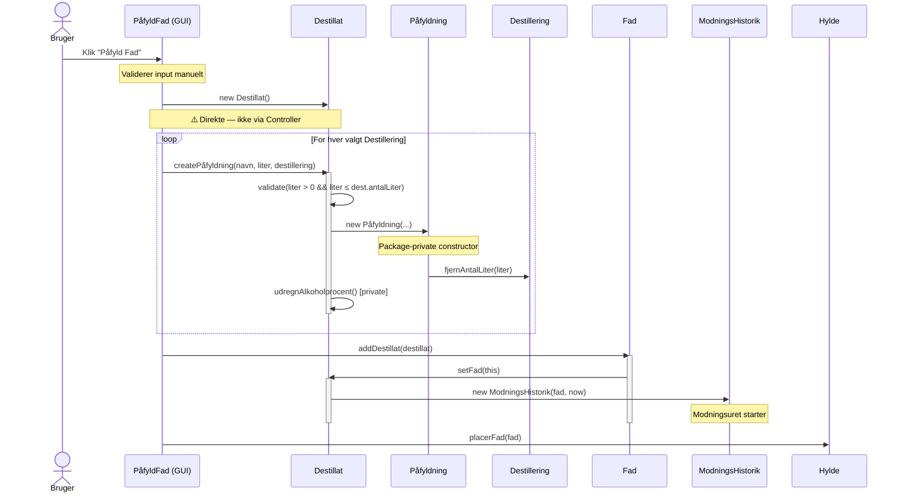
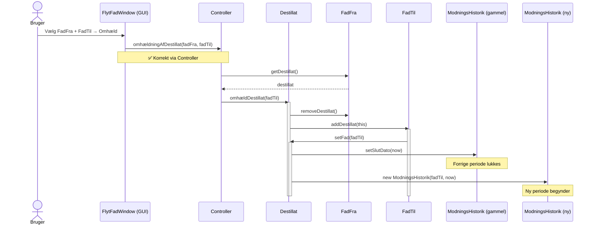
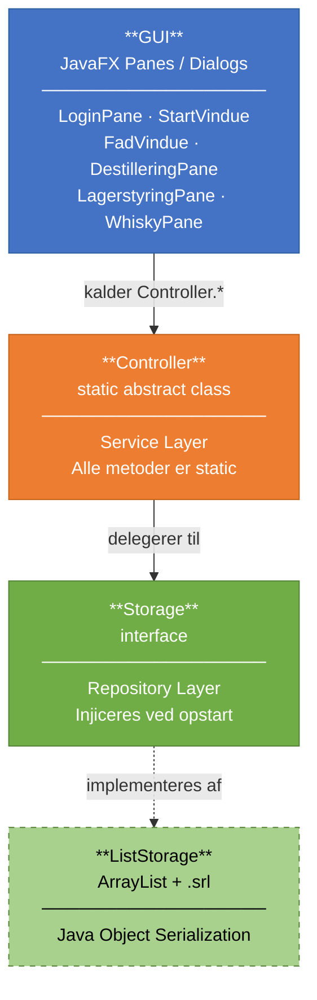
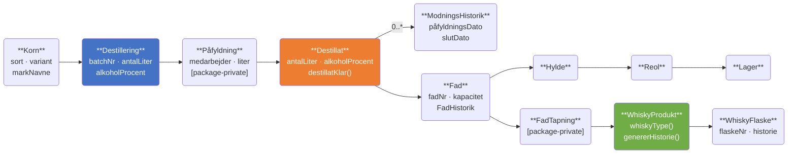

<!-- _class: title -->

# Sall Whisky Destilleri
## Digital sporbarhed fra korn til flaske

3. semester eksamensprojekt · Java 19 · JavaFX · JUnit 5

---

<!-- SLIDE 1: KONTEKST -->
<!-- Case: Kontekst og problemstilling -->

# 1 — Kontekst og problemstilling

**Problemet:** Destilleriet manglede digital sporbarhed

- Hvem lavede hvad, hvornår?
- Hvilke fade har destillatet ligget i?
- Hvornår er whisky'en klar til flaskning?

**Løsningen dækker hele kæden:**

```
Korn → Destillering → Påfyldning → Fad → Lager → Flaskning
```

**Stack:** Java 19 · JavaFX · JUnit 5 · Object serialization (ingen database)

**Gruppe:** [X] personer — mit ansvar: [domænemodellen / Controller / ...]

---

<!-- SLIDE 2: ARKITEKTUR -->
<!-- Case: Hvorfor er koden struktureret som den er? -->

# 2 — Arkitektur: 3 lag, manuelt implementeret

```
┌─────────────────────────────────────────┐
│  GUI  — JavaFX Panes og Dialogs         │  præsentationslag
└───────────────────┬─────────────────────┘
                    │ kalder altid Controller.*
┌───────────────────▼─────────────────────┐
│  Controller  — static abstract class    │  service-lag
└───────────────────┬─────────────────────┘
                    │ delegerer til
┌───────────────────▼─────────────────────┐
│  Storage  — interface                   │  repository-lag
│  └── ListStorage  (ArrayList + .srl)    │
└─────────────────────────────────────────┘
```

- `Storage` er et **interface** injiceret ved opstart → kan mockes i tests
- `Controller` er `static abstract` → svarer til et Service Layer uden framework

> ⚠️ **Selvkritik:** `abstract` + `static` giver ingen mening. Burde være instans-baseret service med interface — så kan den unit-testes med DI.

---

<!-- SLIDE 3: DOMÆNEMODEL -->
<!-- Case: Hvordan modellerede du data og entiteter? -->

# 3 — Domænemodel: whiskyens rejse som objekter

```
Korn ──────────────────────────────────────────────────────────┐
                                                                │
Destillering ←── maltbatch · korn · medarbejder · ABV         │
      │                                                         │
      ▼ (via)                                                   │
   Påfyldning ─────────────────────────────────────────────────┘
      │
      ▼ (opbygger)
   Destillat ──── alkoholprocent (vægtet, auto-beregnet)
      │     └──── ModningsHistorik  (én entry per fad)
      │
      ▼ (placeres i)
    Fad ──── FadHistorik (tidligere indhold, leverandør)
      │
      ▼ (via)  Hylde → Reol → Lager
      │
      ▼ (tappes til)  FadTapning
                          │
                          ▼ (indgår i)
                      WhiskyProdukt ── whiskyType() · genererHistorie()
                          │
                          ▼  WhiskyFlaske  (én per liter)
```

Alle klasser `implements Serializable` · Ingen DTOs · GUI arbejder direkte med domæneobjekter

---

<!-- SLIDE 4: RIG DOMÆNEMODEL — PRIMÆR KODE-SLIDE -->
<!-- Case: Tekniske valg og data-modellering -->

# 4 — Rig domænemodel: `Destillat.java`

### Factory method — validering + sideeffekter samlet ét sted

```java
public Påfyldning createPåfyldning(String medarbejderNavn,
                                    double literPåfyldt, Destillering dest) {
    if (literPåfyldt <= 0 || literPåfyldt > dest.getAntalLiter())
        throw new IllegalArgumentException("Invalid volume.");

    Påfyldning pf = new Påfyldning(medarbejderNavn, literPåfyldt, dest); // package-private!
    påfyldninger.add(pf);
    antalLiter += pf.getLiterPåfyldt();
    udregnAlkoholprocent(); // ← private, kaldes automatisk
    return pf;
}
```

### Domæneregel tæt på data

```java
public boolean destillatKlar() {
    return Period.between(
        modningsHistorik.get(0).getPåfyldningsDato(), LocalDate.now()
    ).getYears() >= 3;
}
```

> `Påfyldning` har package-private konstruktør → kan **kun** oprettes inde fra `Destillat`.
> Compileren håndhæver invarianten — ikke dokumentation.

---

<!-- SLIDE 4b: AUTOMATISK HISTORIKSPORING -->

# 4b — Automatisk historiksporing ved fad-skift

```java
public void setFad(Fad fad) {
    this.fad = fad;
    createModningsHistorik(); // ← kaldes ALTID — umuligt at glemme
}

private ModningsHistorik createModningsHistorik() {
    if (!modningsHistorik.isEmpty()) {
        // Luk forrige periode
        modningsHistorik.get(modningsHistorik.size() - 1)
            .setSlutDato(LocalDate.now());
    }
    ModningsHistorik mh = new ModningsHistorik(fad, LocalDate.now());
    modningsHistorik.add(mh);
    return mh;
}
```

**Gælder både første påfyldning og omhældning** — én metode, nul glemte tilfælde.

`ModningsHistorik`-listen er det der muliggør `whiskyType()`-klassifikationen:
- 1 entry + ingen vand = **Cask Strength**
- 1 entry + vand tilsat = **Single Cask**
- Flere entries (re-barreled) = **Single Malt**

---

<!-- SLIDE 5: SELVKRITIK -->
<!-- Case: Kvalitet og vedligeholdelse — læsbarhed, genbrug, test -->

# 5 — Selvkritik

### ✅ Det der virker

| Valg | Effekt |
|---|---|
| `Storage` interface | Kan mockes — muliggør testbarhed |
| Package-private konstruktører | Invarianter håndhæves af compileren |
| Defensive copies: `new ArrayList<>(påfyldninger)` | Intern tilstand kan ikke muteres udefra |
| Metodenavne følger domænet | Koden læses som domænet — lav kognitiv afstand |

### ❌ Det der ikke virker

| Problem | Konsekvens |
|---|---|
| `static Controller` | Ikke testbar med DI — `abstract` er meningsløst her |
| `int literEthanol` i `WhiskyProdukt` | **Stille bug** — ABV afkortes til heltal. I `Destillat` er det `double`. Formlen er duplikeret og gået ud af sync |
| GUI kalder model direkte (`PåfyldFad`) | Lagdelingen brydes inkonsistent |
| Object serialization | Ingen migration — bryder ved class-rename |
| Ingen transaktioner | Halvt gennemført operation = korrupt state |

---

<!-- SLIDE 6: REFLEKSION — ALTERNATIVER + OVERDRAGELSE -->
<!-- Case: Refleksion — alternativer overvejede du + overdragelse -->

# 6 — Refleksion: alternativer og overdragelse

### Persistens: serialization vs. alternativer

| | Serialization *(valgt)* | SQLite | JSON |
|---|---|---|---|
| Opsætning | Ingen | JDBC/ORM | Jackson |
| Kan inspiceres | ❌ Binær | ✅ SQL | ✅ Tekstfil |
| Migration | ❌ Ingen | ✅ SQL scripts | ⚠️ Manuel |

> Pragmatisk valg — ingen afhængigheder. Men fundamentalt skrøbeligt: rename én klasse og eksisterende data er korrupt.

### Rig vs. anæmisk domænemodel

| | Rig model *(valgt)* | Anæmisk model |
|---|---|---|
| Logik bor i | Entiteten | Service-laget |
| Læsbarhed | Koden = domænet | Mere indirekte |
| Med serialization | ✅ Naturlig | Unødigt kompleks |
| Med JPA | ⚠️ Lazy-loading problem | ✅ Naturlig |

> Rig model følte sig naturligt uden framework. JPA-problematikken mødte jeg da jeg reimplementerede i Spring Boot.

---

<!-- SLIDE 6b: OVERDRAGELSE -->

# 6b — Overdragelse til en anden udvikler

**Rækkefølge:**

1. **Arkitekturdiagrammet** — "Tre lag. Controller er static — det er et dårligt valg, kopier det ikke."
2. **Domænemodellen** — "Forstår du `Destillat`, forstår du 80% af applikationen."
3. **Sekvensdiagrammet for påfyldning** — viser samspillet *og* den arkitektoniske inkonsistens
4. **Tre kritiske ting:**
   - `PåfyldFad` bypasser Controller — inkonsistent, følg det ikke
   - Static counters i `Fad` og `Destillering` gendannes manuelt i `ListStorage` — rør dem ikke uden at forstå serialiseringsflowet
   - Slet `storage.srl` for at resette til sample data

> Sekvensdiagrammerne viser ikke bare *hvad* der sker — men *hvem* der har ansvar.
> En ny udvikler kan se at omhældning går korrekt via Controller, men påfyldning ikke.

---

<!-- SEKVENSDIAGRAM 1 -->

# Sekvensdiagram 1 — Påfyldning af fad

> Render via [mermaid.live](https://mermaid.live) eller VS Code Mermaid Preview



---

<!-- SEKVENSDIAGRAM 2 -->

# Sekvensdiagram 2 — Omhældning (re-barreling)



---

<!-- ARKITEKTUR-DIAGRAM (Mermaid) -->

# Diagram: Arkitektur

> Alternativ til ASCII-diagrammet — brug dette til Mermaid-render



---

<!-- DOMÆNEMODEL-DIAGRAM (Mermaid) -->

# Diagram: Domænemodel



---

<!-- NOTER TIL PRÆSENTATOR -->

# Noter — hvad du skal have klar

### Validering / fejl / logging / sikkerhed (supplerende, ikke slides)

**Validering:**
- Model: `IllegalArgumentException` i `createPåfyldning()`
- GUI: Manuel validering i `PåfyldFad` (volume, tomme felter)
- Inkonsistent — burde samles i Controller

**Fejlhåndtering:**
- `e.printStackTrace()` i `gemProduktHistorieTilFil()` — fejlen sluges stille

**Logging:** Ingen i nogen af versionerne — ville bruge `@Slf4j` i produktion

**Sikkerhed:** Hardcoded `"admin".equals(input)` — acceptabelt for lokal desktop-eksamen

### Test (supplerende)
- `ModelsTest.java` dækker: livscyklus, ABV, `destillatKlar()`, re-barreling, `whiskyType()`
- Mangler: GUI-tests, serialiserings-tests, negativ-tests, Controller-tests

---

# Feedback på casen

*(Casen beder eksplicit om dette)*

✅ Åbner for teknisk og refleksiv dialog

✅ "Frit metodevalg" giver kandidaten mulighed for at vise sig selv

💬 "Backend-delen spiller en central rolle" er svær at efterleve for uddannelsesprojekter uden Spring — men det gav mig en anledning til at vise Spring Boot-rewritet som en sammenligning

💬 Validering / fejl / logging / sikkerhed er bundtet i ét bullet-punkt — det er reelt fire selvstændige emner
